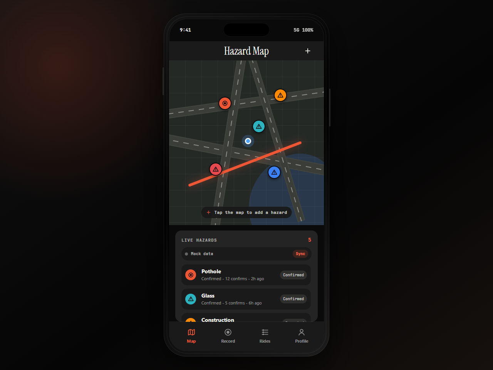
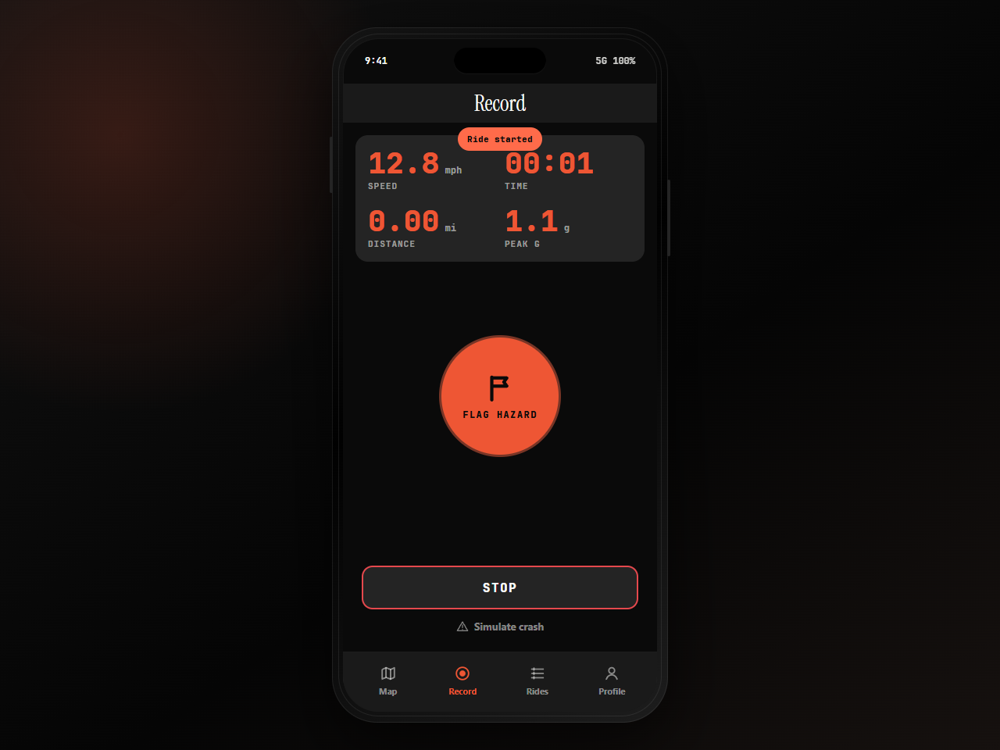
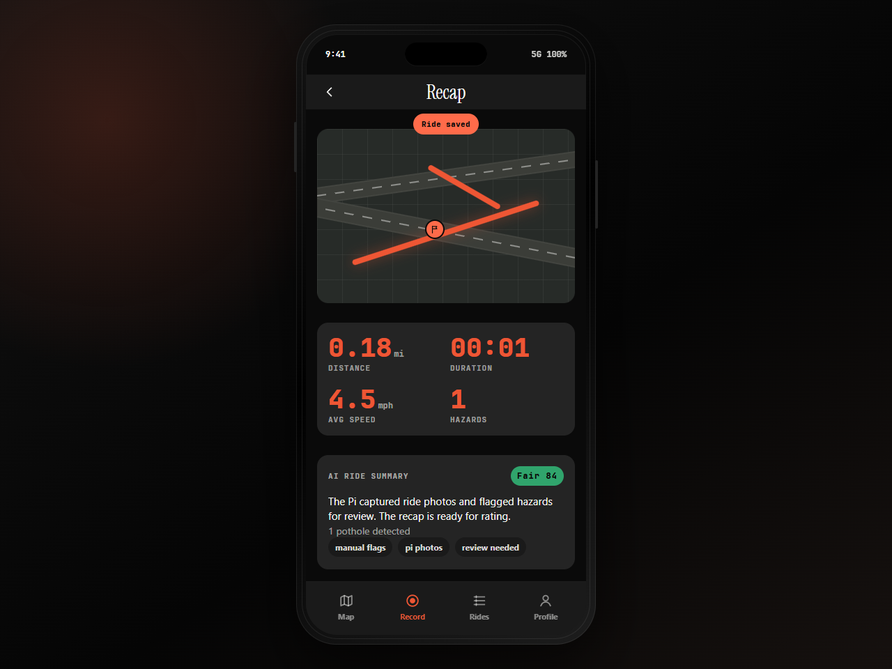
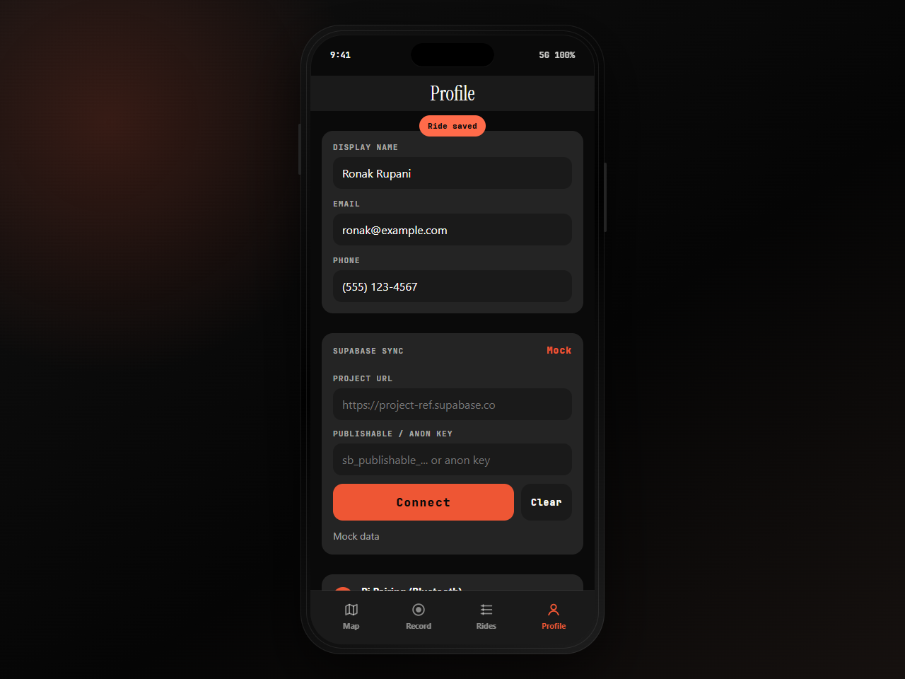

# Blind Spot

**Every bike becomes a sensor. See the road cities can't.**

Blind Spot is a bike safety system that turns ordinary rides into a live map of
road hazards. A rider starts a ride in the phone app, the bike-mounted device
captures dangerous moments, and the app turns those moments into useful reports:
where the hazard happened, what the rider saw, what photos were captured, and
how safe or accessible that route felt.

The goal is simple: help riders avoid bad roads today, and help cities see what
needs to be fixed tomorrow.

## App Preview

The interactive phone demo is built as a static GitHub Pages app in
[`docs/iphone-demo`](docs/iphone-demo). When Pages is enabled for this repo, it
opens at:

https://ronyboxer.github.io/blindspot/iphone-demo/

| Hazard map | Live ride recording |
|---|---|
|  |  |

| Ride recap | Supabase sync |
|---|---|
|  |  |

## The Story

Cyclists see road problems long before a city dashboard does: potholes, glass,
blocked bike lanes, rough pavement, missing bike lanes, and unsafe stretches of
road. Those problems usually stay trapped in individual rides. Blind Spot makes
them visible.

A rider mounts the small camera device on their bike and opens the app. During a
ride, the rider can press one button to flag a hazard. The device can also save
important moments automatically. The phone keeps the ride session, and every
photo is attached to the right ride. After the ride, Blind Spot turns the route,
photos, and safety signals into a recap the rider can understand immediately.

Over time, those individual rides become a shared map. Riders can see where
hazards are, and planners can see where streets repeatedly fail cyclists.

## End-To-End Flow

1. **Start the ride**
   The rider starts a session in the phone app. The app owns the ride timeline,
   route, and rider-facing experience.

2. **Capture the road**
   The bike device captures photos when the rider flags something or when a
   ride event suggests something important happened.

3. **Attach every photo to a ride**
   Each user-triggered photo is tied to the active ride. Automatic captures are
   kept separate from manual rider photos so the data stays organized.

4. **Sync the ride data**
   Rides, photos, automated photos, and summaries sync into Supabase. The phone
   demo can read that live data and update the map, ride list, recap, and photo
   grid.

5. **Explain what happened**
   After a ride, Blind Spot summarizes what the route was like: whether bike
   infrastructure was visible, whether the surface looked rough, whether
   potholes or hazards appeared, and what map tags should be created.

6. **Build the safety map**
   The app shows hazard pins and ride recaps for riders. The same data can help
   advocates and city teams understand where cyclists are repeatedly seeing
   unsafe or inaccessible streets.

## What The Screens Show

**Hazard Map** shows the shared road-safety layer. Pins mark hazards such as
potholes, glass, construction, water, blocked lanes, rough surfaces, and captured
photo locations. Riders can add a hazard directly from the map.

**Record** is the in-ride screen. It keeps the interaction simple: start/stop a
ride, flag a hazard, and trigger the crash-SOS demo flow. The large controls are
designed for a rider who should not be distracted.

**Recap** explains the finished ride. It shows the route, distance, duration,
average speed, hazard count, photos, and a plain-language ride summary.

**Supabase Sync** connects the web demo to the live project data. It reads rides,
manual photos, automated photos, AI summaries, hazards, and ride events. It uses
only a publishable/anon browser key and rejects secret keys.

## What Is In This Repo

```text
app/                 Next.js dashboard and web UI
BlindSpot/           Native SwiftUI iOS app
computer_vision/     Bike-lane, lane-line, and bike-accessibility CV tools
device/              Device capture, button, BLE, serial, and sync code
docs/iphone-demo/    Static GitHub Pages phone demo
ml/                  Hazard-detection command-line helpers
supabase/            SQL schema for rides, photos, automated photos, and summaries
tests/               Python unit tests for device/service logic
```

## Developer Quick Starts

### iOS App

Generate the Xcode project from `project.yml`:

```bash
./bootstrap.sh
```

Then select a simulator or device in Xcode and run the `BlindSpot` target.
`BlindSpot.xcodeproj` and `Info.plist` are generated artifacts and are ignored
by Git; re-run `xcodegen generate` or `./bootstrap.sh` after adding Swift files.

### GitHub Pages Phone Demo

The phone demo is static HTML/CSS/JS, so it does not need a build step:

```bash
cd docs
python -m http.server 4176
```

Then open:

```text
http://127.0.0.1:4176/iphone-demo/
```

For Supabase sync, use the in-app Profile screen and enter the project URL plus a
publishable/anon key. Do not use a service-role or secret key in the browser.

### Web Dashboard

```bash
cd app
pnpm install
pnpm dev
```

### Device Mock Loop

```powershell
python -m device.scripts.run_device --mock --duration 8
python -m device.scripts.simulate_event manual_flag
python -m device.scripts.photo_button --mock --once
python -m unittest discover -s tests
```

### Computer Vision

```powershell
cd computer_vision
uv run main.py --model models/tusimple.onnx
uv run analyze_bike_accessibility.py --images ../data/lane_tests
```

The TuSimple Ultra Fast Lane Detection model should be placed at
`computer_vision/models/tusimple.onnx`. `computer_vision/download_model.py` can
fetch the expected public ONNX file.

## Device Capture

The Python device stack supports mock development and Raspberry Pi deployment.
It includes photo capture, local buffering, GPIO button gesture handling, BLE
ride-control messaging, USB serial demo commands, Supabase photo uploads, and
ride summary integration.

Button gesture defaults:

| Gesture | Meaning |
|---|---|
| Single click | Capture a manual hazard photo |
| Double click | Start or stop local video recording |
| Press and hold | Start or stop a ride |

Default GPIO assumptions:

| Hardware | Raspberry Pi pin |
|---|---|
| Button | BCM GPIO17 / physical pin 11 to GND |
| Addressable LED strip data | BCM GPIO18 / physical pin 12 |

## Supabase Data Contract

Run [`supabase/blindspot_device_schema.sql`](supabase/blindspot_device_schema.sql)
in the Supabase SQL editor before testing uploads.

Manual rider photos are inserted into `public.photos`. Machine-triggered
captures such as impact, hard-brake, swerve, crash, and interval frames are
inserted into `public.automated_photos`. Both paths require a real `ride_id`
tied to `public.rides`, so uploads do not create orphan photo rows.

Store project URLs, publishable keys, app secrets, and API keys only in local
environment files or device-local config. The repo ignores `.env` files and
app/device secret files.

## Tests

Run the Python checks from the repository root:

```powershell
python -m unittest discover -s tests
```

Run the web and iOS checks from their respective toolchains when changing those
areas.
